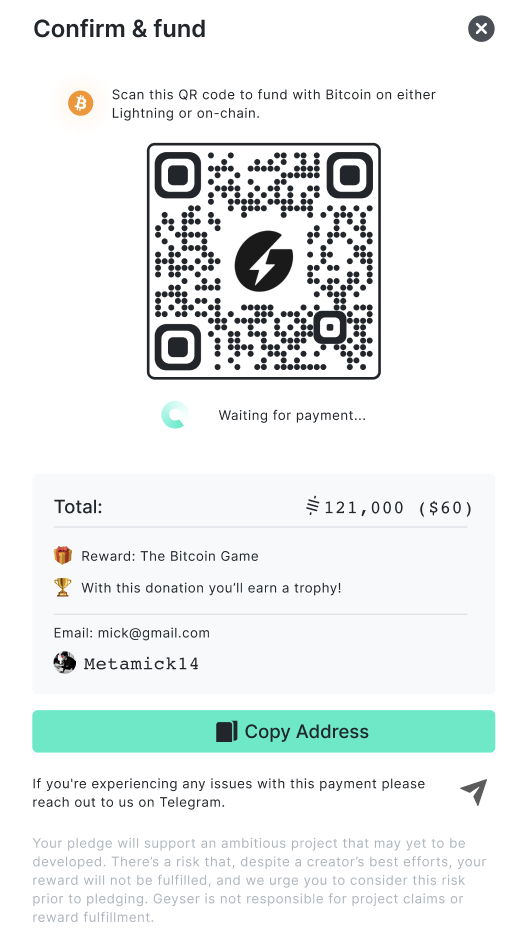
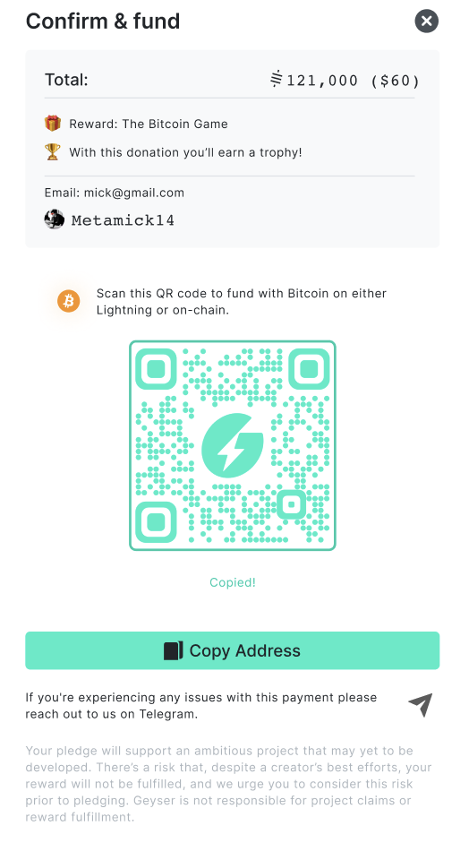

# Geyser Fun(d): Implement an invoice view

## Task

Implement an invoice payment view based on the provided design.

## Requirements

* A user **must** be able to copy the invoice by clicking on the 
QR code
* The invoice QR code **must** appear in a pop up after a user clicks on a `Fund` button
* The modal **must** show a success screen when a payment goes through (you can mock the payment, no need to implement any payment logic)

## Design 

**Figma:** https://www.figma.com/file/Ho2Lb1k5ouDoJzNlq4sp3B/Untitled?node-id=0%3A1 
<!-- **Assets:** viewable in [`/assets`](assets) -->
**Screen Capture:**
1. Waiting for payment

1. Invoice copied

